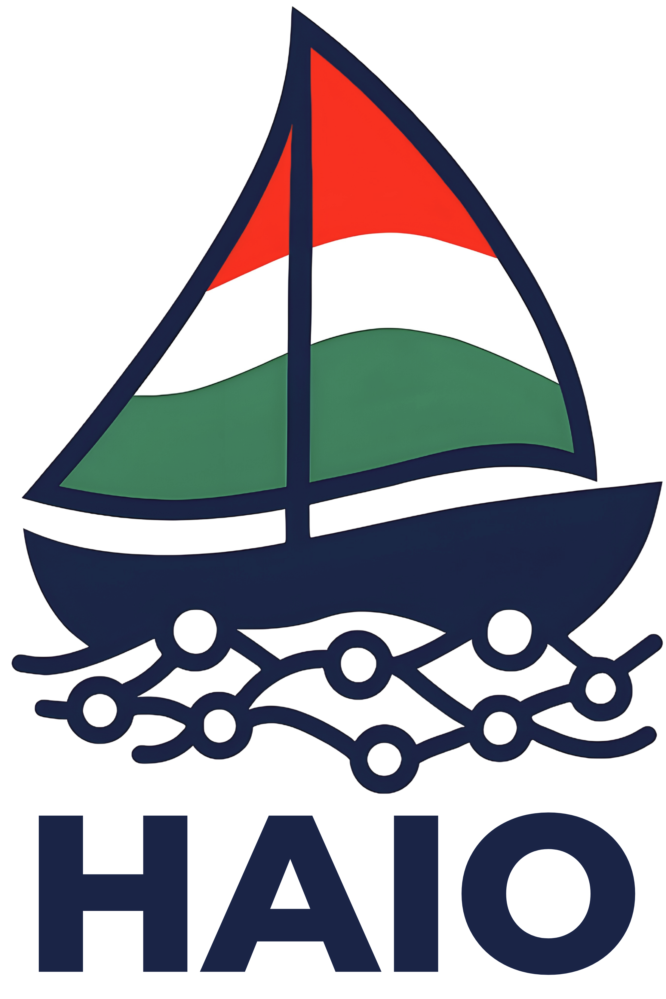

<p align="center">
  
</p>

<h1 align="center">Magyar MI Diákolimpia</h1>
<h3 align="center">Hungarian AI Olympiad</h3>

<p align="center">
  
  
  
  
</p>

<p align="center">
  <a href="#magyar">🇭🇺 Magyar</a> · <a href="#english">🇬🇧 English</a>
</p>

<p align="center">
  <a href="https://tehetseg.inf.elte.hu/mi_olimpia/">Weboldal</a> ·
  <a href="https://discord.gg/KKTzNebjGW">Discord</a> ·
  <a href="https://www.linkedin.com/company/hungarian-ai-olympiad-haio/">LinkedIn</a> ·
  <a href="https://www.instagram.com/haio.official/">Instagram</a> ·
  <a href="mailto:midiakolimpia@gmail.com">E-mail</a>
</p>

---

<a id="magyar"></a>

## A versenyről

A **Magyar MI Diákolimpia (HAIO)** Magyarország hivatalos mesterséges intelligencia versenye 9-13. osztályos diákok számára. A verseny célja, hogy a középiskolás diákok megismerkedjenek a gépi tanulás, a számítógépes látás, a természetes nyelvfeldolgozás és a megerősítéses tanulás alapjaival, és versenyhelyzetben alkalmazzák tudásukat.

A verseny az [ELTE Informatikai Kar](https://www.inf.elte.hu/) szervezésében valósul meg. A legjobb versenyzők képviselik Magyarországot az [IOAI](https://ioai-official.org/) (International Olympiad in Artificial Intelligence), [IAIO](https://www.ircai.org/iaio/) (International Artificial Intelligence Olympiad) és [CEOAI](https://ceoai-official.org/) (Central European Olympiad in Artificial Intelligence) nemzetközi versenyeken.

## Versenyszakaszok

A verseny évről évre bővül:

| Forduló | Formátum | Leírás | Mióta |
|---------|----------|--------|-------|
| **Nyári Online** | Kaggle | Online válogató, ML feladat nyilvános ranglista alapján | 2025 |
| **Nyári Országos** | Helyszíni | Országos döntő az ELTE-n: elméleti + gyakorlati (CV, NLP, ML, RL) | 2024 |
| **Nyári Tábor** | Helyszíni | Felkészítő tábor és utolsó válogató a nemzetközi csapatba | 2026 |
| **Téli Országos** | Helyszíni | Országos forduló | 2026 |
| **Téli Tábor** | Helyszíni | Felkészítő tábor és utolsó válogató | 2026 |

## Évfolyamok

| Év | Fordulók | Feladatok | Mappa |
|----|----------|-----------|-------|
| **2024** | Nyári Országos | 10 feladat (4 CV, 4 NLP, 2 elméleti) | [`2024/`](2024/) |
| **2025** | Nyári Online + Nyári Országos | 5 feladat (1 ML online + 1 elméleti + 4 gyakorlati) | [`2025/`](2025/) |
| **2026** | Nyári Online + Nyári Országos + Nyári Tábor + Téli Országos + Téli Tábor | 2 feladat *(eddig)* | [`2026/`](2026/) |

## Repó felépítése

```
haio-program/
├── 2024/
│   ├── docs/                          # Versenyszabályzat
│   └── nyari-orszagos/                # Feladatok, megoldások, elméleti rész
├── 2025/
│   ├── docs/                          # Versenyszabályzat, adatkezelési, one-pagerek
│   ├── nyari-online/                  # Kaggle feladat + adatok
│   └── nyari-orszagos/                # Feladatok, megoldások, elméleti rész
├── 2026/
│   ├── docs/                          # Versenyszabályzatok (nyári + téli)
│   └── nyari-online/                  # Kaggle feladatok + adatok
└── logos/                             # HAIO arculati elemek
```

## Hasznos linkek

- [Tematika (MÓLÓ)](https://tehetseg.inf.elte.hu/mi_olimpia/molo) - felkészülési útmutató és tananyag
- [Eredmények 2024](https://tehetseg.inf.elte.hu/mi_olimpia/archive/2024/results)
- [Eredmények 2025 Online](https://tehetseg.inf.elte.hu/mi_olimpia/archive/2025/online-results) · [Eredmények 2025 Országos](https://tehetseg.inf.elte.hu/mi_olimpia/archive/2025/results)
- [Hall of Fame](https://tehetseg.inf.elte.hu/mi_olimpia/hall-of-fame) - nemzetközi szereplések

## Technikai környezet

- **Nyelv:** Python 3.10+
- **Platform:** Google Colab / Jupyter Notebook
- **Könyvtárak:** PyTorch, scikit-learn, pandas, numpy, transformers, gymnasium
- **Adatok:** A repóban vagy Google Drive-on elérhetők

## Partnerek

<p align="center">
  <strong>Bosch</strong> · <strong>Ericsson</strong> · <strong>Hungarikum Alkusz</strong> · <strong>Andersen</strong> · <strong>MSCI</strong>
</p>
<p align="center">
  Nemzeti Tehetség Program (NTP) · HPC · ELTE · NJSZT
</p>

## Kapcsolat

- Weboldal: [tehetseg.inf.elte.hu/mi_olimpia](https://tehetseg.inf.elte.hu/mi_olimpia/)
- E-mail: [midiakolimpia@gmail.com](mailto:midiakolimpia@gmail.com)

## Licenc

Ez a repó [MIT licenc](LICENSE) alatt érhető el.

---

<a id="english"></a>

## About the Competition

The **Hungarian AI Olympiad (HAIO)** is Hungary's official artificial intelligence competition for high school students (grades 9-13). The competition introduces students to machine learning, computer vision, natural language processing, and reinforcement learning, and challenges them to apply their knowledge in a competitive setting.

Organized by the [ELTE Faculty of Informatics](https://www.inf.elte.hu/). Top performers represent Hungary at [IOAI](https://ioai-official.org/) (International Olympiad in Artificial Intelligence), [IAIO](https://www.ircai.org/iaio/) (International Artificial Intelligence Olympiad), and [CEOAI](https://ceoai-official.org/) (Central European Olympiad in Artificial Intelligence).

## Competition Stages

The competition expands each year:

| Round | Format | Description | Since |
|-------|--------|-------------|-------|
| **Summer Online** | Kaggle | Online qualifier, ML task scored on public leaderboard | 2025 |
| **Summer National** | On-site | National finals at ELTE: theoretical + practical (CV, NLP, ML, RL) | 2024 |
| **Summer Camp** | On-site | Training camp and final selection for international teams | 2026 |
| **Winter National** | On-site | National round | 2026 |
| **Winter Camp** | On-site | Training camp and final selection | 2026 |

## Editions

| Year | Rounds | Tasks | Folder |
|------|--------|-------|--------|
| **2024** | Summer National | 10 tasks (4 CV, 4 NLP, 2 theoretical) | [`2024/`](2024/) |
| **2025** | Summer Online + Summer National | 5 tasks (1 ML online + 1 theoretical + 4 practical) | [`2025/`](2025/) |
| **2026** | Summer Online + Summer National + Summer Camp + Winter National + Winter Camp | 2 tasks *(so far)* | [`2026/`](2026/) |

## Useful Links

- [Syllabus (MÓLÓ)](https://tehetseg.inf.elte.hu/mi_olimpia/molo) - preparation guide and study materials
- [Results 2024](https://tehetseg.inf.elte.hu/mi_olimpia/archive/2024/results)
- [Results 2025 Online](https://tehetseg.inf.elte.hu/mi_olimpia/archive/2025/online-results) · [Results 2025 National](https://tehetseg.inf.elte.hu/mi_olimpia/archive/2025/results)
- [Hall of Fame](https://tehetseg.inf.elte.hu/mi_olimpia/hall-of-fame) - international performances

## Partners

<p align="center">
  <strong>Bosch</strong> · <strong>Ericsson</strong> · <strong>Hungarikum Alkusz</strong> · <strong>Andersen</strong> · <strong>MSCI</strong>
</p>
<p align="center">
  National Talent Program (NTP) · HPC · ELTE · NJSZT
</p>

## Contact

- Website: [tehetseg.inf.elte.hu/mi_olimpia](https://tehetseg.inf.elte.hu/mi_olimpia/)
- Email: [midiakolimpia@gmail.com](mailto:midiakolimpia@gmail.com)

## License

This repository is available under the [MIT License](LICENSE).
